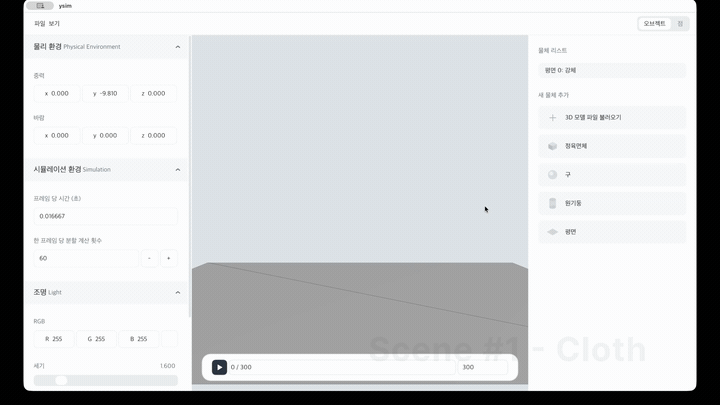

# ysim

A macOS physics simulation engine for **cloth dynamics** and **rigid bodies** with GPU-accelerated collision detection.

## Demo

<!-- DEMO-VIDEO-SLOT: replace the line below with the recorded gif once available -->
<p align="center">
  
  <br>
  <em>Cloth draping over an imported mesh — real-time GPU simulation.</em>
</p>

> _Demo clip pending — drop `media/demo.gif` here._

## Highlights

- **Dual-GPU strategy** — OpenGL for rendering, Metal compute for simulation.
- **GPU collision pipeline** — broad phase (LBVH / Morton codes) → narrow phase (point–triangle) → constraint response, all on Metal.
- **Cloth models** — `TriangularCloth` and `FastGridCloth`, plus `Rigid` bodies, each with its own parameter set and sim path.
- **Backend-parameterized core** — types are templated on backend (`CPU` / `CUDA` / `METAL`): `MeshState<BE,PR>`, `Scene<BE,PR>`, `VectorBase<BE,PR>`.
- **Built-in profiling** — `FrameProfiler` tracks named timing sections with CSV export to `profiles/`.

## Build

```bash
cmake -B build
cmake --build build
./build/ysim          # runnable from any cwd (paths resolve via exe dir + project root)
```

**Requires:** CMake 3.10+, C++17, Eigen 5.0+, GLFW 3.4, GLEW, OpenGL, Metal (macOS), Xcode CLI tools (for `xcrun metal` shader compilation).

Metal shaders build as part of the CMake run: `.metal` → `.air` (per file via `xcrun metal -c`) → `default.metallib` (via `xcrun metallib`).

## Architecture

- `src/main.cpp` — simulation setup, main loop, and GUI (ImGui, OpenGL backend).
- `src/metal/` — compute shaders carrying the bulk of the sim:
  - `physics.metal` — spring forces, cloth grid physics.
  - `bvh.metal` — BVH build, Morton codes, broad-phase collision.
  - `bruteforce.metal` — point–triangle narrow-phase collision.
  - `spatialhashing.metal` / `mlspatialhashing.metal` — spatial-hash broad-phase variants.
- `arch-test/`, `arch-test-handmade/` — greenfield re-architecture experiments (virtual-interface and C++20-concepts designs); the live engine in `src/` is untouched by them.

## Layout

```
src/        engine + Metal shaders
assets/     meshes (Human.obj, teapot.obj, …)
scenes/     scene definitions
profiles/   profiler CSV output
docs/       design notes
```
